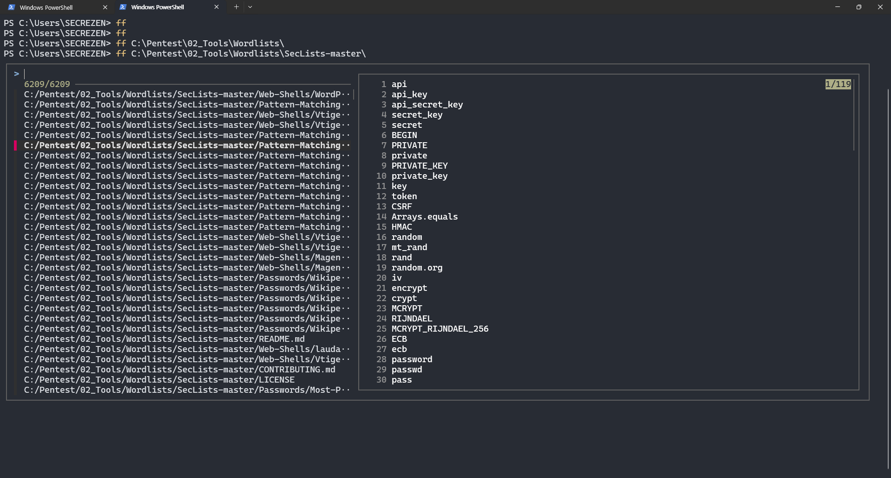
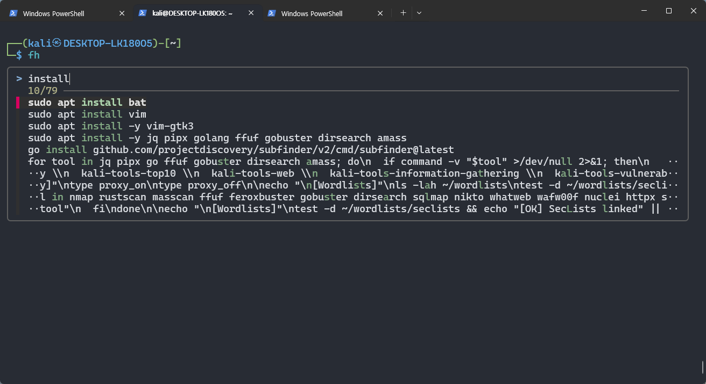
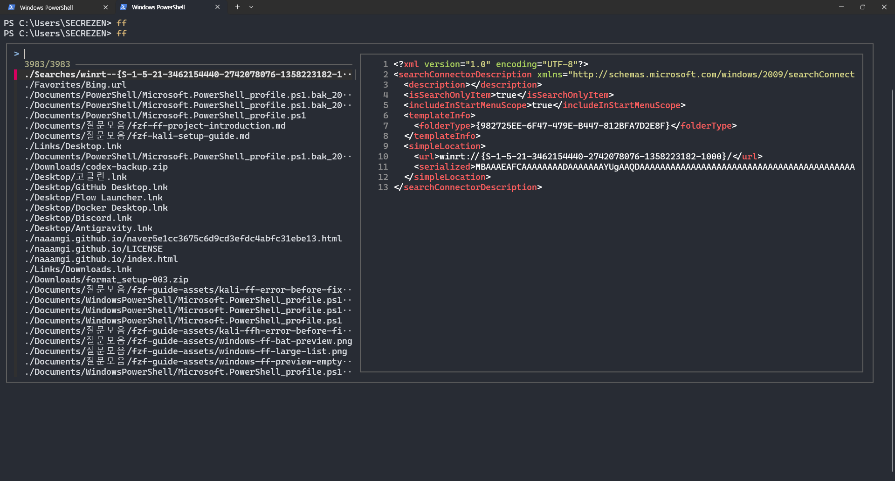
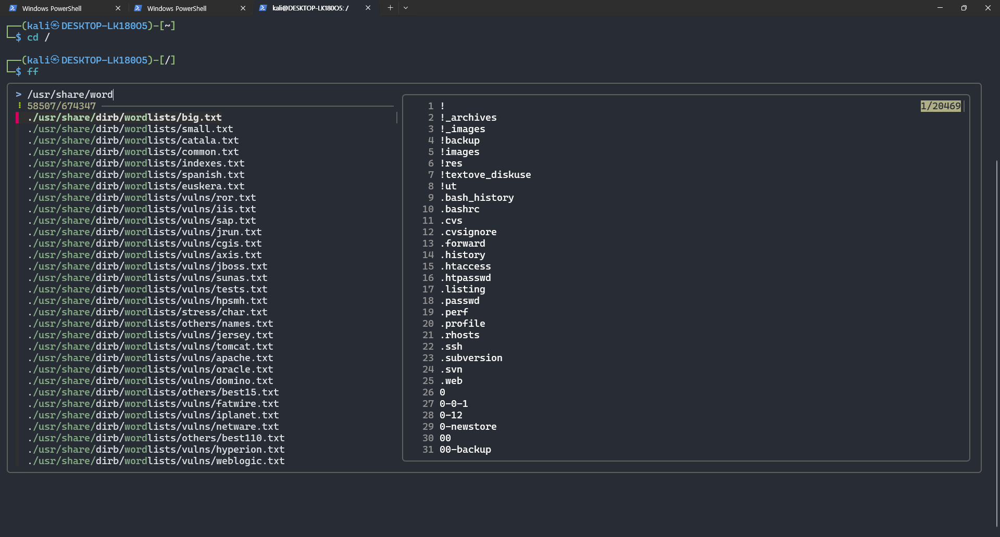

<div align="center">

# fuzzy-terminal-kit

**파일 검색 · 내용 미리보기 · 명령어 기록 검색**

Windows PowerShell 5.1 / 7 · Kali WSL Bash / Zsh

[다운로드](https://github.com/naaamgi/fuzzy-terminal-kit/archive/refs/heads/main.zip) · [설치](#설치) · [사용법](#사용법) · [상세 가이드](docs/reference.md)

</div>



왼쪽에서 파일을 고르면 오른쪽에 내용이 표시됩니다. 위 화면의 `api_key`, `token` 등은 선택한 SecLists 파일의 패턴 문자열입니다.

## 설치

**ZIP 다운로드 → 전체 압축 해제 → 설치 → 새 터미널 열기**

| Windows PowerShell 5.1 | Kali WSL |
|---|---|
| **`install-windows.cmd` 더블클릭** | 프로젝트 폴더에서 **`bash install.sh`** |
| 필요한 도구를 WinGet으로 설치 | Bash/Zsh 감지, 필요한 도구를 apt로 설치 |

기존 설정은 백업합니다. 재설치해도 설정 블록을 중복 추가하지 않습니다. 패키지 설치 시 확인 창이나 sudo 비밀번호 입력이 필요할 수 있습니다.

<details>
<summary>PowerShell 7 · 셸 직접 지정</summary>

PowerShell 7 창에서:

```powershell
pwsh -NoProfile -ExecutionPolicy Bypass -File .\install.ps1
```

Kali에서 셸을 직접 선택하려면:

```bash
bash install.sh --shell bash
# 또는
bash install.sh --shell zsh
```

설치기 전체를 `sudo`로 실행하지 마세요. 패키지 설치 단계에서만 권한을 요청합니다.

</details>

## 사용법

| 명령·키 | 동작 |
|---|---|
| `ff [경로]` | 파일 검색·미리보기 후 선택 경로 출력 |
| `ffh [경로]` | 숨김 파일을 포함해 검색 |
| `fh [검색어]` | 기록 검색 후 선택한 명령 출력 |
| `Ctrl+R` | 기록을 찾아 입력줄에 삽입 |
| `Ctrl+T` | 파일 경로를 입력줄에 삽입 |
| `Alt+C` | 폴더를 찾아 이동 |

```bash
ff
ff /usr/share/wordlists
ffh ~/.config
fh nmap
```

Windows 경로도 지정할 수 있습니다: `ff 'C:\Pentest\Wordlists'`

**선택만으로 명령을 실행하지 않습니다.** 기록을 수정해서 실행하려면 `Ctrl+R`을 사용하세요.

### 명령어 기록 검색



`fh`에서 `install`을 검색한 화면입니다. 설치 관련 명령어 기록을 모아 볼 수 있습니다.

<details>
<summary>파일 미리보기 예제 더 보기 — Windows / Kali</summary>

#### Windows · 파일 내용 확인



사용자 홈에서 `ff`를 실행한 화면입니다. 왼쪽은 파일 경로, 오른쪽은 선택한 `Searches` 폴더 아래 파일의 XML 내용입니다.

#### Kali · 워드리스트 확인



`cd /` 후 `ff`를 실행하고 `/usr/share/word`를 검색한 화면입니다. 오른쪽은 `/usr/share/dirb/wordlists/big.txt`의 내용입니다. `.bashrc`, `.ssh`는 워드리스트 문자열이며 실제 사용자 설정이 아닙니다.

</details>

*스크린샷은 기존 설정의 사용 예입니다. 배포 버전의 경로 표시와 미리보기 범위는 다를 수 있습니다.*

## 검색 팁

| 검색창 입력 | 의미 |
|---|---|
| `'wordlist` | 문자열을 연속해서 포함 |
| `^scan` | 해당 문자열로 시작 |
| `.txt$` | 해당 문자열로 끝 |
| `!backup` | 해당 문자열 제외 |

↑/↓ 이동 · Enter 선택 · Esc 취소 · Alt+J/K 미리보기 스크롤

파일 **경로**를 검색하고 선택 파일을 미리 봅니다. 내용 전체 검색은 하지 않습니다. 미리보기는 앞 300줄이며, `ffh`도 ignore 규칙과 제외 폴더는 유지합니다.

## 제거

Windows는 **`uninstall-windows.cmd` 더블클릭**, Kali는 다음 명령을 실행합니다.

```bash
bash install.sh --uninstall
```

프로젝트의 설정 블록만 제거합니다. 이후 추가한 사용자 설정과 백업은 보존합니다.

---

[설정·복원·문제 해결](docs/reference.md) · [검증 기록](docs/validation.md)

Built with [fzf](https://github.com/junegunn/fzf), [fd](https://github.com/sharkdp/fd), [bat](https://github.com/sharkdp/bat).
